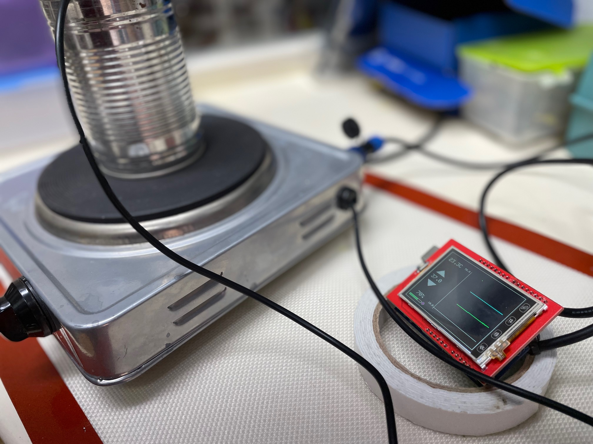

# Sousvide controller

# Parts/Bill of material

Prices shown below are just the `first hit` on duckduckgo; if you shop around a bit - you may well get much lower prices on Aliexpress.

1. Hotplate, € 9.99 https://www.obelink.nl/tristar-kp-6185-kookplaat.html
2. Solid state relay € 5-10 euro; 16 Ampere https://www.amazon.nl/-/en/dp/B09F9WK7JP/ref=sr_1_14
3. Arduino UNO https://www.kiwi-electronics.nl/nl/arduino-uno-rev3-atmega328-729
4. 2.4 inch TFT screen € 5-10 https://www.aliexpress.com/item/32923876240.html
5. Waterproof Temperature sensor: € 2-5 https://www.hobbyelectronica.nl/product/ds18b20-waterdicht/ or alternatively the https://www.amazon.nl/MAX6675-Temperatuur-Thermokoppel-Schroef-Arduino/dp/B07Y9YJ3HG/ref=sr_1_5 for a wider range.
6. Some 5 volt adaptor € 2-3 https://nl.aliexpress.com/item/1005001863054181.html
7. Any 10-22 k resistor (1/16 watt or more)
 
# Wiring

The trick here is that we continue use the original knob and temperature safeties. So these still set a 'max'.

# Enclosure

## OpenSCAD version

## STEP/Fusion version

# Result

